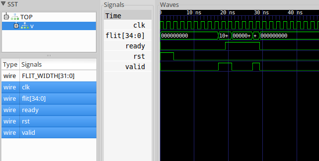

In the first tutorial you will learn about the basic flow control. In
the folder `tutorials/tutorial_01` you find the file `tutorial_01.v`
that contains the tutorial toplevel and two modules: `source` and
`sink`. Each of the modules has a small state machine to wait for
certain conditions or number of cycles (as verilator does not support
testbenches and behaves like synthesis). While this is triggered by
the positive clock edge, we concurrently perform the combinational
output by a second process which is triggered on the negative edge.

The source:

* waits for reset to be de-asserted
* waits for five clock cycles
* asserts a flit and sets valid
* waits while ready is not also active
* inserts a pause for two cycle and sets another flit

The sink:

* waits for reset to be de-asserted
* accepts the first flit after six cycles by setting ready
* keeps ready active
* waits for the second flit

You can compile the tutorial by running `make`. Then execute the
binary `./tutorial_01`, which writes a waveform to
`tutorial_01.vcd`. Inspect this file with gtkwave or similar and you
will find this output:

	

