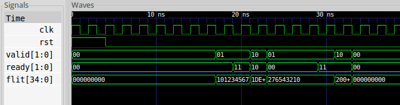

In the first tutorial you have learned about the basics of flit
transmission in LISNoC. In this tutorial you will learn the very basic
idea of virtual channel flow control. In the working folder
`tutorials/tutorial_02` you will find this tutorial's toplevel
`tutorial_02.v`, which is a slight modification of the previous
tutorial. You will find, that the `ready` and `valid` signals are all
of width 2, which is the number of virtual channels here.

If you run `make` and execute the tutorial (`./tutorial_02`) you will
again find a waveform in `tutorial_02.vcd`:

The very basic idea of virtual channels can be seen in the screenshot:
The source can only set one valid signal at any time and there is only
one flit signal. When the same bit is also set in the sink the flit
was actually transfered:

* At 17ns the source starts transmission on channel 0
* On the next clock edge, the sink is not ready
* Now (19ns) the sink indicates it can receive on both channels
* On the next clock edge the transfer on channel 0 was successful
* The sink indicates it cannot receive on channel 0 any more at 21ns.
  In the tutorial the sender does concurrently set to channel 1, so
  there is no dependency in this case (read [Virtual
  Channels](virtualchannels.html) about dependencies in general)
* After another successful transmission the source pauses
* Finally another flit is transfered on each virtual channel
